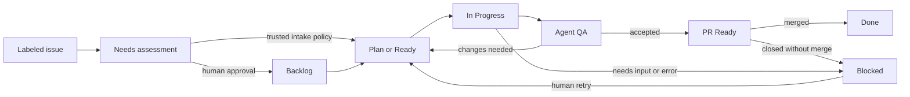

# Cortexium Runner

`cortexium-runner` moves trusted or maintainer-approved GitHub Project work through
planning, implementation, agent review, and a pull request that waits for a
human decision by default.

It runs locally against your existing Git checkout, GitHub CLI login, and AI
command-line tools. There is no hosted control plane, webhook receiver, inbound
server, or required GitHub Actions workflow.

> [!WARNING]
> Runner can create Project fields and cards, branches, worktrees, and pull
> requests. Codex and Claude roles are sandboxed by default. A role configured
> with `"access": "host"` can access files, processes, networks, browsers, and
> credentials available to your OS account. Pi has no native OS sandbox, so
> Pi implementation and review require that explicit host opt-in. Use host
> access only on a trusted machine and repository, keep automatic merge
> disabled initially, and review every change.
> `"harness_config": "isolated"` is the default and suppresses ambient harness
> rules, tools, plugins, skills, hooks, and MCP servers. `"inherit"` deliberately
> loads the operator's native harness configuration; out-of-process helpers may
> retain OS permissions outside a native shell sandbox. Combining
> `"access": "host"` with `"harness_config": "inherit"` is unrestricted agent
> execution under the Runner operating-system account.
> Configured repository references expose their entire root, including ignored
> files, to planner and reviewer roles. Use dedicated reference checkouts that
> contain no credentials or unrelated private material.

Sandboxed Codex roles receive only minimum runtime reads plus their assigned
repository/worktree. Sandboxed Claude roles deny reads from the operator's home
directory except for the exact assigned root and the implementer's npm cache;
required system paths remain readable. This is strong least-privilege policy,
not a credential boundary around the harness process itself.

## Install

Install the latest macOS or Linux release into `~/.local/bin`:

```bash
curl -fsSL https://raw.githubusercontent.com/cortexium-io/runner/main/scripts/install.sh | sh
```

The installer detects Intel or ARM, downloads the matching release archive,
verifies it against the published `SHA256SUMS`, checks the binary version, and
never uses `sudo`. Release origins and every redirect must use HTTPS, including
when `CORTEXIUM_RUNNER_RELEASES_URL` selects an operator-controlled mirror.

If `~/.local/bin` is not already on your `PATH`:

```bash
export PATH="$HOME/.local/bin:$PATH"
```

Then verify the installation:

```bash
cortexium-runner --version
cortexium-runner --help
```

Installed release builds can check for or install a newer release in place:

```bash
cortexium-runner update --check
cortexium-runner update
```

Use `cortexium-runner update --version vMAJOR.MINOR.PATCH` to install an exact
release, including an intentional downgrade. The command applies the same
checksum, archive-shape, and binary-version checks as the bootstrap installer
and atomically replaces the resolved executable. Run `cortexium-runner doctor`
after updating; if a release adds Project fields, rerun `init` to synchronize
them before starting Runner. Updating the file does not restart a Runner process
that is already running; stop and restart that process to use the new release.

To inspect the installer before running it:

```bash
curl -fsSL https://raw.githubusercontent.com/cortexium-io/runner/main/scripts/install.sh -o install-runner.sh
less install-runner.sh
sh install-runner.sh
rm install-runner.sh
```

Pass a release tag to install a specific version:

```bash
curl -fsSL https://raw.githubusercontent.com/cortexium-io/runner/main/scripts/install.sh | sh -s -- v0.1.0
```

To build the current checkout instead, use the Go version declared in
[`go.mod`](go.mod):

```bash
go install ./cmd/cortexium-runner
```

## Prerequisites

Runner supports macOS and Linux. The prebuilt Runner binary does not require
Go; Go is needed only when building from source.

### Install Git and GitHub CLI

On macOS with [Homebrew](https://brew.sh/):

```bash
brew install git gh
```

On Linux, install [Git](https://git-scm.com/downloads/linux) with your
distribution's package manager, then follow the official
[GitHub CLI instructions](https://github.com/cli/cli/blob/trunk/docs/install_linux.md)
for your distribution. Confirm both commands are available:

```bash
git --version
gh --version
```

Authenticate GitHub CLI and grant access to GitHub Projects:

```bash
gh auth login
gh auth refresh -s project
gh auth status
```

The selected GitHub account must be able to read and update the target
repository and Project, and the repository must have GitHub Issues enabled so
approved cards have a durable discussion. Runner also needs a local checkout
whose `origin` points to that repository.

### Install one AI CLI

Install and authenticate at least one harness. Runner can use the same harness
for every role or a different harness per role.

Codex CLI ([official instructions](https://developers.openai.com/codex/cli/)):

```bash
curl -fsSL https://chatgpt.com/codex/install.sh | sh
codex
```

On first launch, choose a supported Codex sign-in method.

Claude Code ([official instructions](https://code.claude.com/docs/en/getting-started)):

```bash
curl -fsSL https://claude.ai/install.sh | bash
claude
claude auth status
```

Complete Claude's sign-in flow, then confirm that `claude auth status` reports
that you are logged in.

Pi ([official instructions](https://github.com/earendil-works/pi/blob/main/packages/coding-agent/README.md)):

```bash
curl -fsSL https://pi.dev/install.sh | sh
pi
```

In Pi, run `/login` and select the provider and account or credential that you
want Runner to use. Pi 0.84.2 or newer is recommended. Runner enables Pi's
strict JSON-schema sampling for its standard read, shell, edit, and write tools
for each launched assignment; no global Pi setting or extension is required.
For LM Studio Qwen models, Runner sends the configured reasoning effort and
defaults `preserve_thinking` to `false` to keep earlier reasoning from growing
later requests. Configure one Pi role with:

```bash
cortexium-runner role edit ROLE --preserve-reasoning
cortexium-runner role edit ROLE --no-preserve-reasoning
```

The final structured formatting turn always disables reasoning and preservation
for reliable JSON. A matching LM Studio preset is useful for manual sessions,
but Runner does not rely on the UI default.

> [!CAUTION]
> Pi with LM Studio is experimental in this release. A complete local Qwen 3.8
> project run succeeded, but it also showed very long inference times, excessive
> context and tool turns, work beyond the assigned card, and an occasional
> malformed structured review result. Runner recovers the observed missing
> summary case, but other local models or server versions may behave differently.
> Start with a private test project, one concurrent card, automatic merge off,
> and generous timeouts. Monitor the first full lifecycle before relying on this
> combination unattended. Codex CLI or Claude Code is the safer default when
> predictable execution matters.

You do not need all three harnesses. Verify only the ones you intend to select:

```bash
codex --version
claude --version
pi --version
```

`cortexium-runner init` checks the selected prerequisites without installing
package managers or using `sudo`. If anything is missing, it prints manual
recovery guidance. After initialization, `cortexium-runner doctor` verifies the
GitHub connection, repository write access and merge compatibility, harness
availability, configuration, and installed skills. A least-privileged GitHub
account may be unable to read classic branch-protection details; Doctor reports
that limitation and the exact policy to verify instead of assuming the branch
is compatible.

## Interactive quick start

Open a terminal in the repository you want Runner to manage:

```bash
cd /path/to/your/repository
```

First preview the guided setup. This asks whether to create or adopt a Project,
which harness and model to use, how many cards may run concurrently, and whether
pull requests require a human merge. The dry run does not create or modify
GitHub resources, write the config, or install skills. Runner suggests
`.cortexium/runner.json` in the repository; press Enter to accept it or type a
different project-local or external path.

```bash
cortexium-runner init --dry-run
```

If the preview is correct, run the same setup without `--dry-run`:

```bash
cortexium-runner init
```

The resulting board shows `Runner Activity` and `QA Failures` directly on its
cards. Activity is `Planning`, `Implementing`, or `Reviewing` while an agent
owns the card. A recognized transient Codex outage shows `Waiting for harness
provider` while Runner performs three delayed retries without consuming a QA
rejection. Existing unrelated visible fields are preserved; the internal
`Runner Phase` recovery and `Runner Transition` lock fields are hidden. If that
display is changed later, `doctor` reports it and rerunning `init` restores the
overview.

Initialization prints the exact config path and next commands. Assign that path
once if you want to use the shorter examples below:

```bash
RUNNER_CONFIG="$PWD/.cortexium/runner.json"
```

For the project-local default, Runner ensures the config is ignored, adding its
exact path to the root `.gitignore` when needed. It does not stage or commit
that change. From anywhere inside that Git repository, later commands such as
`doctor`, `add`, `run`, `status`, and `plan` find this default automatically. Use
`--config PATH` only for a different location.

Verify local configuration first, then connected GitHub and harness readiness:

```bash
cortexium-runner workflow validate --config "$RUNNER_CONFIG"
cortexium-runner workflow explain --config "$RUNNER_CONFIG"
cortexium-runner doctor --offline --config "$RUNNER_CONFIG"
cortexium-runner doctor --config "$RUNNER_CONFIG"
```

Run one bounded polling cycle:

```bash
cortexium-runner run --once --config "$RUNNER_CONFIG"
```

When that behaves as expected, run continuously in the foreground:

```bash
cortexium-runner run --config "$RUNNER_CONFIG"
```

Stop it with `Ctrl-C`. Runner gives an interrupted attempt a short bounded
integrity-check window, returns the card to the role's previous lane, and
retains its isolated worktree for the next run. Installing Runner starts no
background service.

Add a goal for the planner, or one already-specified implementation card, even
while Runner is active:

```bash
cortexium-runner add plan --title "Plan CSV export" --body-file export-goal.md
cortexium-runner add ready --title "Fix the CSV header" --body-file fix-card.md
```

Use `--dry-run` to preview the destination without changing GitHub. `add plan`
asks the normal event loop to run the planner and stage a dependency-aware
proposal for review. `add ready` authorizes the exact card for implementation
once its declared dependencies have succeeded and required resources are free.

## How work moves



By default, humans decide which assessed work enters an executable lane. With
autonomous issue intake enabled, Runner may make that authorization decision
for a labeled issue when the configured intake repository is private or the
issue author is explicitly allowlisted. It always sends the issue through the
same planner: unclear work produces questions on the issue and moves to
`Blocked`; clear work produces one or more exact implementation cards. Trusted
planner output is released automatically. Other issue intake remains in
`Needs assessment` for a human.

Enable the private-repository policy during initialization with
`--autonomous-issues`. For a public repository, repeat
`--trusted-issue-author LOGIN` for each allowed author. Repository visibility,
not GitHub Project visibility, defines the private trust boundary.

Putting an ordinary unsigned card in `Plan` asks the planner to shape its exact
current snapshot. Putting one in `Ready` authorizes that snapshot for the
implementer. Runner converts either Project draft to an issue in the configured
intake repository, then signs it before claiming it. Planner output
stays as reversible Project drafts until exact-batch approval; that approval is
human by default and automatic only for a still-trusted issue source. Approval
converts every released child to an issue before it can become executable.
Forged or content-modified approvals and unreleased planner batches still fail
closed.
An ordinary card can declare prerequisites with an exact `## Dependencies`
bullet list of Project item IDs or GitHub issue URLs. Runner starts it only when
every referenced card has a Runner-authenticated successful outcome; moving a
prerequisite to `Done` by hand is not sufficient.
Issue comments authored by the GitHub account currently authenticated in `gh`
and captured before the assignment are included as bounded historical context;
other authors cannot change an approved task through comments. When Agent QA
requests changes, Runner posts a readable,
idempotent comment to the issue and also retains authenticated local retry
feedback. The next implementer therefore receives QA's requested changes even
without a human comment, while a human can add or clarify instructions in the
same issue conversation before moving the card back to `Ready`.

When Runner observes an authenticated merged-PR outcome, it closes that
implementation issue as completed. If a planner created several cards from one
source issue, the source stays open until every exact child in the released
batch has merged successfully. Runner does not rely on a child PR's closing
keyword, so whichever PR happens to merge first cannot close the original
request early. A manual move to `Done`, a blocked child, or a PR closed without
merge does not satisfy the aggregate.

## Harnesses and roles

| Harness | Planner | Implementer | Reviewer |
| --- | --- | --- | --- |
| Codex CLI | Yes | Yes | Yes |
| Claude Code | Yes | Yes | Yes |
| Pi CLI | Yes | Yes | Yes |

These are adapter capabilities, not model-quality certifications. You choose
the harness and model for each role. Every harness uses the same simplified
planner and reviewer contracts. The planner states observable completion
conditions and proof obligations; the implementer chooses the smallest reliable
way to prove them after inspecting the repository. Runner enforces the shared
result, workspace-integrity, and lifecycle contracts.

Planning never guesses model capability from a model name. During `init`, choose
regular or smaller task sizing. Smaller sizing creates more explicit cards for
less capable downstream agents without weakening their requirements. The saved
config represents these choices as `planning_support: standard|high`. Change
either role later with, for example:

```bash
cortexium-runner role edit implementer --config "$RUNNER_CONFIG" --planning-support high
cortexium-runner role edit reviewer --config "$RUNNER_CONFIG" --planning-support high
```

Override both downstream roles for one planning call without changing the saved
configuration:

```bash
cortexium-runner plan --small-tasks
```

Smaller task sizing gives each card one primary independently verifiable behavior and
scopes it with substantial margin inside the implementer timeout. It splits
independent acceptance clusters while keeping tightly coupled behavior together.

An optional implementer ladder can start with a smaller model and move to the
next operator-configured role only after Agent QA requests changes. The
Project's persisted QA failure count selects the rung, so restarting Runner
does not reset or skip escalation. Omit `implementer_ladder` for one fixed
implementer, or configure two or more role profiles up to the workflow's
`max_qa_rejections`. The last profile handles any remaining allowed QA
rejections before the card blocks.
Authentication, permission, capability, configuration, timeout, cancellation,
and integrity failures still block for an operator; they never spend another
model call automatically. See the
[operator reference](docs/operator-reference.md#implementer-ladder) for
configuration commands and an example.

Planner and probe launches remain tightly constrained. Implementers work inside
a Runner-created worktree; after implementation ends, Runner creates a private
detached checkout of the exact candidate commit for review. Reviewers start in
a neutral directory with that candidate checkout as their assigned read root.
Codex and Claude use their native
sandbox in the default `sandboxed` mode. `host` is an explicit per-role escape
hatch. The independent `harness_config` setting defaults to `isolated`, which
suppresses unrelated user plugins, ungranted MCP servers, project instructions,
and skills and keeps the role's fixed tool ceiling. Set it to `inherit` to load
the native user/project configuration; `host` plus `inherit` is unrestricted.
For a new config, pass `init --harness-config inherit`. For an existing config,
apply the same mode to all three built-in role contracts atomically:

```bash
cortexium-runner role edit --all --harness-config inherit
```

Custom roles inherit the changed built-in policy unless they carry an explicit
override. The command preserves every role's access mode and rejects the whole
edit before replacing the config if the resulting combination is invalid.
Integrity checks reject reviewer mutations and changes to the retained
implementation worktree or active checkout, but cannot contain external side
effects from a host-access process.
Pi implementer and reviewer roles require `host`, and every inherited Pi role
requires `host`, because Pi does not provide an OS sandbox for ambient shell and
edit tools.

Planner and reviewer roles can also receive pinned evidence from secondary
local Git checkouts. Add an optional top-level list, then run connected doctor:

```json
"repository_references": [
  {
    "name": "legacy-frontend",
    "path": "/absolute/path/to/legacy-frontend",
    "commit": "714128eaeb8e3805431f8fdeaa49a570e2830cea"
  }
]
```

Runner verifies the exact clean checkout and commit again immediately before
each eligible launch. It never changes the reference, and implementers never
receive it. Sandboxed Codex and Claude keep it read-only; Pi references require
explicit host access. See [repository references](docs/operator-reference.md#repository-references)
for the complete safety and maintenance contract.

Sandboxed Codex and Claude implementers and reviewers receive Runner's safe
development tools by default. `npm` and `npx` stay inside the role's native
filesystem sandbox; implementer network access is limited to the npm registry
and loopback. The sandbox can read the assigned workspace and required system
tools, but not the rest of the operator's home directory; the npm cache is the
implementer's narrow home-directory exception. Browser checks use a pinned
three-tool Chrome DevTools server with a temporary profile, mock keychain,
disabled external name resolution, telemetry/CrUX, and redacted headers.
Runner resolves that trusted server from a separate mode-`0700` host-owned cwd
and reusable package cache that the harness sandbox cannot write; project
`.npmrc` and ambient npm state cannot replace it. Per-invocation npm
configuration remains temporary.
Navigation is restricted to `localhost` and `127.0.0.1`. Runner never uses the
operator's normal browser profile or downloads a browser; a compatible local
Chrome or Chromium 149+ installation is required only for browser checks.
Ordinary `doctor`
reports browser availability but does not fail a non-browser project merely
because Chrome is absent, unless the operator explicitly requires that
capability. The pinned MCP package may be fetched through `npx` on first use.

Pi implementer and reviewer roles receive the same pinned, isolated,
loopback-only browser through a Runner-generated Pi extension. Pi still requires
explicit `host` access because it has no native OS sandbox; the browser grant
does not make Pi's shell access sandboxed. Disable safe tools per role when that
host boundary or the local browser is inappropriate.

Tool availability never creates a verification requirement. Runner roles use
the product's actual entrypoint and require browser checks only when the
request, repository, or acceptance contract includes browser-facing behavior.
The approved card's proof obligations are authoritative for implementation and
Agent QA, while the implementer owns the proof method. It may extend the
existing focused tests when that is the smallest durable protection for changed
behavior or a meaningful failure invariant. Agents do not replace the
obligations with broader suites, repeat expensive passing checks, or create a
second test framework or custom harness. Broad or long-running checks belong on
the narrowest integration card that needs them. Runner stores the implementer's
evidence privately, binds it to the exact approved content and candidate
commit/tree, and gives it to Agent QA as evidence—not instructions. QA first
performs one source-and-evidence audit without running tests. If that pass leaves
a concrete proof question unresolved, Runner starts a fresh focused-verification
call containing only those unresolved keys. The reviewer reuses existing focused
checks and never creates a second test framework, broad benchmark, or unrelated
diagnostic path.

After a Project planning card produces an executable result, Runner saves the
exact normalized plan in a private checkpoint before creating children. If
GitHub staging fails partway through, an exact retry skips the planner, reuses
matching staged children, and creates only the missing ones. Planning-content
or context changes invalidate the checkpoint; Runner never silently deletes a
partial batch.

After a successful implementer result, Runner also saves a private checkpoint
bound to the approved content, review and human-comment context, exact worktree
snapshot, branch, and candidate commit/tree. If later Runner or GitHub
post-processing fails, an exact retry resumes that completed result without
calling the implementation harness again. Any task, context, base, or workspace
change invalidates the checkpoint and requires normal implementation.
Recoverable candidate-content failures publish a sanitized correction and clear
the saved result so a plain retry reruns implementation; `retry --feedback`
also clears it intentionally.

When a multi-card result needs integration or release evidence that no delivery
card can establish, the planner adds a final project-readiness card. Ordinary
cards use focused checks. The readiness card runs the repository's complete
established local suite once plus the smallest required real-entrypoint smoke.
This is the explicit local go-live gate; Runner does not create or require CI,
or add browser or deployment work to projects that do not need it.

Disable these defaults for a role when they are not appropriate:

```bash
cortexium-runner role edit reviewer --config "$RUNNER_CONFIG" --no-safe-tools
cortexium-runner doctor --config "$RUNNER_CONFIG"
```

Custom MCP servers remain explicit per-role grants. They are separate trusted
local processes, so Runner never inherits them as safe defaults.

For a complete local adapter smoke test, run `harness check`. It makes paid live
model calls through every configured execution-role profile and exercises the
planner's read-only repository path, the implementer's isolated worktree write
and integrity verification, and the reviewer's shared review contract. Runner
uses a private temporary Git repository and performs no GitHub operations. Add
`--browser` to exercise browser access for implementer and reviewer profiles
whose safe tools are enabled. Host-access and inherited profiles retain their
configured authority, which the report labels explicitly.

`doctor --probe-harnesses` and ordinary `harness check` do not run browser QA.
If a required capability is still unavailable, Runner blocks the card with a
retry destination instead of
treating an unrun check as passed. A capability-blocked review does not consume
a QA rejection. When QA does request changes, Runner stores the
actionable detail privately beside its state and supplies it to the next
implementation, while the GitHub Project receives only a bounded summary.
Runner also supplies that retained feedback to the subsequent reviewer so it
can verify the correction before independently reviewing the cumulative diff.
A failed proof obligation records the review result but does not stop that
bounded audit: the reviewer continues through its remaining card-owned behavior
and groups directly adjacent variants of an exposed invariant so one QA attempt
returns all reasonably visible blockers together.

## Useful commands

```bash
# Current Project and runner state
cortexium-runner status --config "$RUNNER_CONFIG"

# Validate and explain configured event/action composition
cortexium-runner workflow validate --config "$RUNNER_CONFIG"
cortexium-runner workflow explain --config "$RUNNER_CONFIG"

# Sanitized current stage for each active agent attempt
cortexium-runner status --verbose --config "$RUNNER_CONFIG"

# Local usage, timing, harness-call count, saved-result resumes, and attempt history
cortexium-runner metrics --config "$RUNNER_CONFIG"

# Preview and retry a blocked card
cortexium-runner retry --dry-run --config "$RUNNER_CONFIG"
cortexium-runner retry --config "$RUNNER_CONFIG"

# Replace stale feedback and force a fresh implementation attempt
cortexium-runner retry --config "$RUNNER_CONFIG" --item ITEM_ID \
  --feedback "Correct the reported candidate validation failure."

# Optional minimal live calls to configured harnesses
cortexium-runner doctor --probe-harnesses --config "$RUNNER_CONFIG"

# Paid planner, implementer, and reviewer conformance in a temporary repository
cortexium-runner harness check --config "$RUNNER_CONFIG"

# Also prove configured implementer and reviewer browser access
cortexium-runner harness check --browser --config "$RUNNER_CONFIG"
```

Every command supports `--help`. `doctor --probe-harnesses` and `harness check`
make live model calls; ordinary `doctor` does not.

`status --verbose` uses only Runner's fixed stage telemetry. It does not retain
or print prompts, model responses, tool commands, subprocess arguments, or
worktree paths.

## More documentation

- [Getting started](docs/getting-started.md): expected output, safe checkpoints,
  and reset steps.
- [Operator reference](docs/operator-reference.md): all commands, configuration,
  workflow, retry, metrics, and role behavior.
- [Architecture](docs/architecture.md): execution, authority, and security
  boundaries.
- [Claude Code quickstart](docs/claude-code-quickstart.md): Claude-only setup.
- [Maintainer setup](docs/open-source-maintainer-setup.md): testing and releases.
- [Contributing](CONTRIBUTING.md) and [security policy](SECURITY.md).

## Project status

Runner is work-in-progress beta software, not a production-proven service.
Interfaces and behavior may still change. Try it on a private or throwaway
repository before using it for important work, and report defects through
GitHub Issues.

The entire implementation and documentation were produced by AI agents under
human direction, testing, and review. Treat it with the same scrutiny as any
unfamiliar automation with repository access.

Licensed under the [MIT License](LICENSE).
